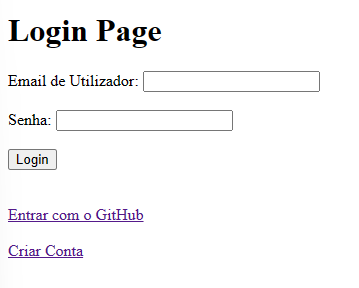
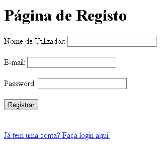
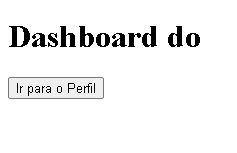
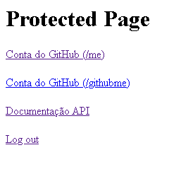
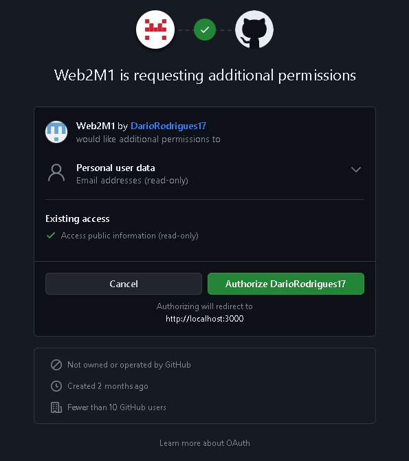
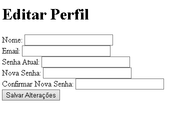

# Parte 1 -> API

Neste repositório está o projeto desenvolvido para a Unidade Curricular Desenvolvimento Web II, do segundo semestre do segundo ano do curso de Informática da Universidade da Maia. Desenvolvido pelo Grupo _23_: [Bernardo Magalhães](mailto:A38819@umaia.pt), [Dario Rodrigues](mailto:A038042@umaia.pt) e [João Aragão](mailto:A0939132@umaia.pt).

## Tema

Este trabalho tem como objetivo criar um serviço web para gestão de eventos desportivos. O sistema permite o registo de jogadores, criação de jogos e registo de resultados. Além disso, os utilizadores autenticados têm acesso a recursos protegidos, como a listagem de jogadores e jogos.

## Galeria 

|            |   |            |
| ---------------------------- | ----------- | ----------- |

|            |   |            |
| ---------------------------- | ----------- | ----------- |

## Tecnologias

As principais tecnologias utilizadas neste projeto são:
* OAuth 2.0
* JavaScript
* NodeJS
* MySQL
* OpenAPI
* HTML5
* CSS3

### Frameworks e Bibliotecas

* Docker
* Express
* Passport

### Apresentação da API
* Capítulo 1: [Apresentação da API](doc/c1.md)
### Recursos
* Capítulo 2: [Recursos](doc/c2.md)
### Produto
* Capítulo 3: [Resultado Final](doc/c3.md)

 

## Grupo _23_
* Bernardo Magalhães [A38819@umaia.pt](mailto:A38819@umaia.pt)
* Dario Rodrigues [A038042@umaia.pt](mailto:A038042@umaia.pt)
* João Aragão [A0939132@umaia.pt](mailto:A0939132@umaia.pt)
