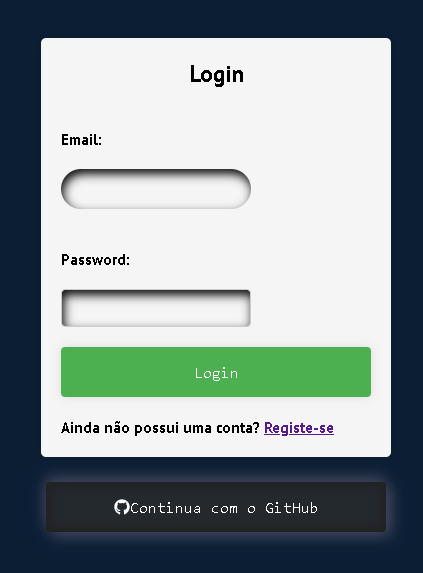
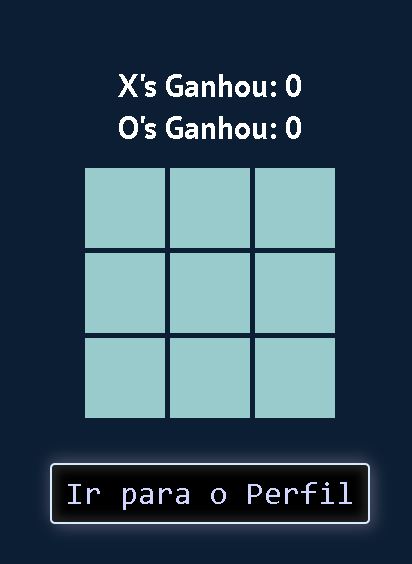
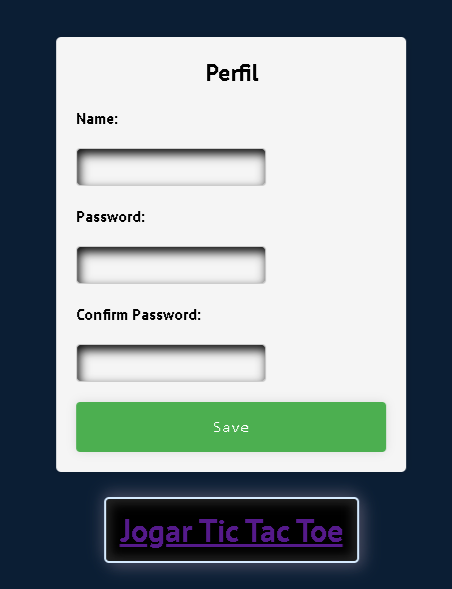

# Parte 2 -> React

Neste repositório está o projeto desenvolvido para a Unidade Curricular Desenvolvimento Web II, do segundo semestre do segundo ano do curso de Informática da Universidade da Maia. Desenvolvido pelo Grupo _23_: [Bernardo Magalhães](mailto:A38819@umaia.pt), [Dario Rodrigues](mailto:A038042@umaia.pt) e [João Aragão](mailto:A0939132@umaia.pt).

## Tema

Este trabalho tem como objetivo criar um serviço web para gestão de eventos desportivos. O sistema permite o registo de jogadores, criação de jogos e registo de resultados. Além disso, os utilizadores autenticados têm acesso a recursos protegidos, como a listagem de jogadores e jogos.

## Organização do repositório 

_O repositório está organizado da seguite maneira:_
* **Código Fonte API** está na pasta [API](src/).
* **Código Fonte ReactJS** está na pasta [react](src/).
* **Documentação** está na pasta [doc](src/).
* [Documento MYSQL](src/api/openapi.yaml) para criação da Base de Dados.
* [Documento Docker-compose](Queries_base_de_dados.sql)para puxar as imagens dos repositórios DockerHub e montar a aplicação.

## Galeria 

|            |   |
|            |   |
|            |   |
| ---------------------------- | ----------- |

## Tecnologias Utilizadas

_As tecnologias usadas neste projeto, foram as seguites:_
* OAuth 2.0
* JavaScript
* NodeJS
* MySQL
* OpenAPI
* HTML5
* CSS3
* JS

### Frameworks e Livrarias 

* Docker
* NodeJS
* ReactJS

### Apresentação da API
* Capítulo 1: [Apresentação da API](doc/c1.md)
### Recursos
* Capítulo 2: [Recursos](doc/c2.md)
### Produto
* Capítulo 3: [Resultado Final](doc/c3.md)

 

## Grupo _23_
* Bernardo Magalhães [A38819@umaia.pt](mailto:A38819@umaia.pt)
* Dario Rodrigues [A038042@umaia.pt](mailto:A038042@umaia.pt)
* João Aragão [A0939132@umaia.pt](mailto:A0939132@umaia.pt)
